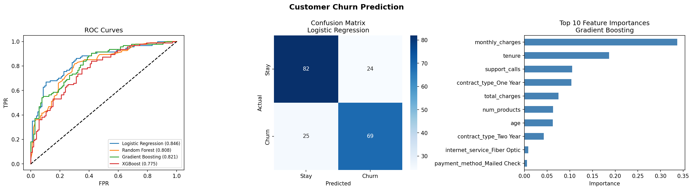

# Customer Churn Prediction

A machine learning project that predicts whether a customer will leave a service based on historical behavioral data. Multiple classification algorithms are trained, compared, and evaluated to identify the best-performing model and key churn factors.

---

## Project Structure

```
Customer Churn Prediction/
├── data_generator.py      # Generates synthetic customer dataset
├── churn_model.py         # Trains, evaluates, and visualizes models
├── customer_data.csv      # Generated dataset (1000 customers)
├── churn_analysis.png     # Output visualization
├── requirements.txt       # Python dependencies
└── README.md
```

---

## Features Used

| Feature | Description |
|---|---|
| `age` | Customer age (18–70) |
| `tenure` | Months with the service (1–72) |
| `monthly_charges` | Monthly billing amount ($20–$120) |
| `total_charges` | Total amount billed |
| `num_products` | Number of products subscribed |
| `support_calls` | Number of support calls made |
| `contract_type` | Month-to-Month / One Year / Two Year |
| `payment_method` | Credit Card / Bank Transfer / Electronic Check / Mailed Check |
| `internet_service` | DSL / Fiber Optic / No |
| `churn` | Target variable — 0 (Stay) or 1 (Churn) |

---

## Models Trained

4 classification models are trained and compared in this project:

### 1. Logistic Regression
- A simple and interpretable linear model
- Predicts the probability of churn using a sigmoid function
- Works well when the relationship between features and churn is roughly linear
- Features are scaled using `StandardScaler` before training
- Best performing model in this project (AUC = 0.8463)

### 2. Random Forest
- An ensemble of multiple decision trees
- Each tree is trained on a random subset of data and features
- Final prediction is made by majority voting across all trees
- Naturally handles non-linear relationships and feature interactions
- Provides built-in feature importance scores

### 3. Gradient Boosting
- Builds trees sequentially — each tree corrects the errors of the previous one
- Focuses more on hard-to-predict customers with each iteration
- Slower to train but often very accurate
- Good at capturing complex patterns in customer behavior

### 4. XGBoost (Extreme Gradient Boosting)
- An optimized and faster version of Gradient Boosting
- Uses regularization to prevent overfitting
- Highly popular in industry and ML competitions
- Handles missing values and large datasets efficiently

---

### Evaluation Metrics Used

Each model is evaluated using:
- Classification Report (Precision, Recall, F1-score)
- AUC-ROC Score
- 5-Fold Cross-Validation AUC

---

## Results

| Model | AUC | CV-AUC | Accuracy |
|---|---|---|---|
| Logistic Regression | 0.8463 | 0.8578 | 76% |
| Gradient Boosting | 0.8211 | 0.8349 | 71% |
| Random Forest | 0.8079 | 0.8388 | 73% |
| XGBoost | 0.7755 | 0.8227 | 69% |

**Best Model: Logistic Regression (AUC = 0.8463)**

---

## Output Visualization

`churn_analysis.png` contains 3 panels:
- **ROC Curves** — compares all 4 models
- **Confusion Matrix** — predictions of the best model
- **Feature Importance** — top 10 churn-driving factors



---

## How to Run

**1. Clone the repository**
```bash
git clone https://github.com/your-username/customer-churn-prediction.git
cd customer-churn-prediction
```

**2. Install dependencies**
```bash
pip install -r requirements.txt
```

**3. Generate the dataset**
```bash
python data_generator.py
```

**4. Train and evaluate models**
```bash
python churn_model.py
```

---

## Requirements

- Python 3.8+
- pandas
- numpy
- scikit-learn
- xgboost
- matplotlib
- seaborn

Install all at once:
```bash
pip install -r requirements.txt
```

---

## Key Insights

- Customers on **Month-to-Month contracts** are more likely to churn
- Higher **monthly charges** and more **support calls** increase churn risk
- Longer **tenure** significantly reduces churn probability
- More **products subscribed** slightly reduces churn likelihood

---

## License

This project is open source and available under the [MIT License](LICENSE).
